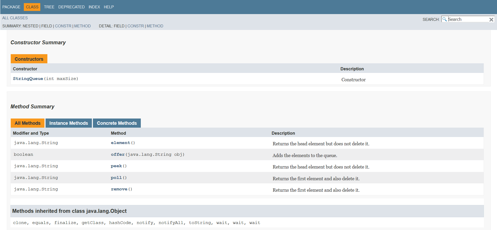
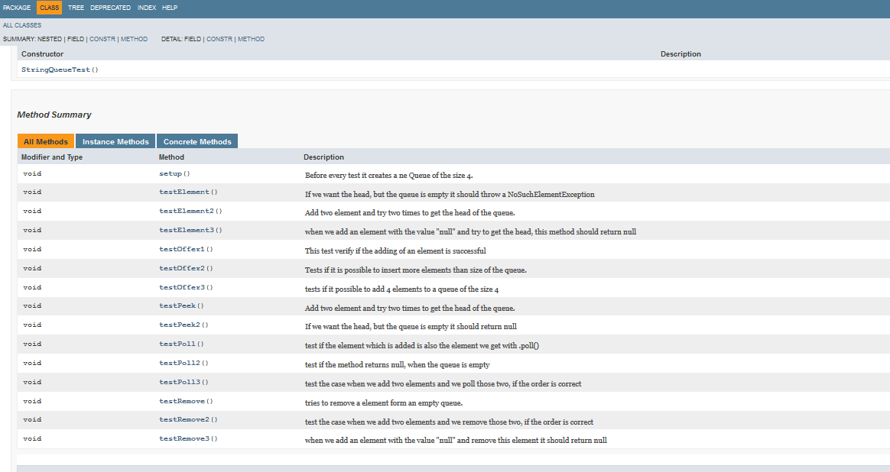
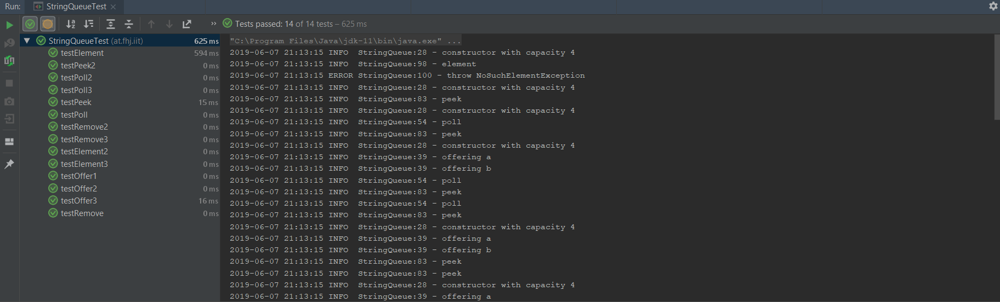
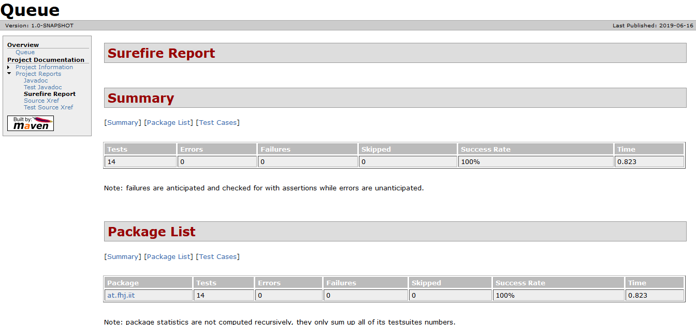
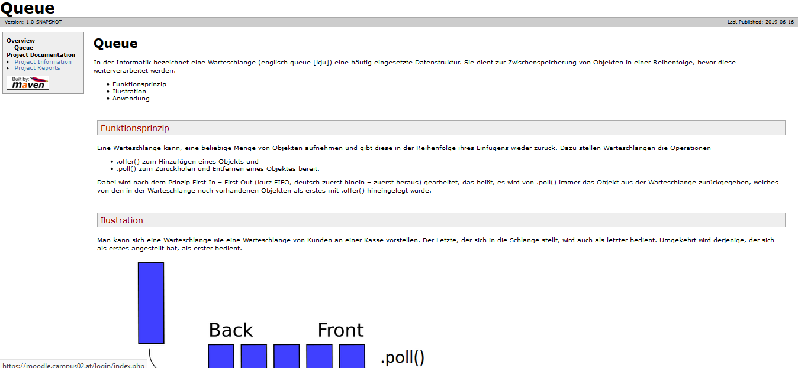

# LAB REPORT 19-Abgabe04-Prassl-Walenta

***
| Abgabe: | 4                                                        |
|---------|:---------------------------------------------------------|
| Name:   | Georg Praßl                                              |
| Name:   | Günther Walenta                                          |
| URL:    | https://github.com/Greeny1992/19-Abgabe04-Prassl-Walenta |
***


## Vorgehen

### 1. Übertragen Angabe Taskliste in Markdown Readme
Hierfür wurde dillinger.io zur Hilfe genommen

### 2. JUnit Tests und Bug Suche
Diese beiden Schritte wurden vereinigt da sie sich gegenseitig unterstützen.
Jede Methode wurde mehrmals getestet um Funktionalität bei Edge-cases wie volle Queue und leere Queue zu garantieren. 
Die gefundenen Fehler waren:
- ein falsch gewählter vergleichsoperator(== statt >) in poll()
- eine Zeile in remove die das element mit "" überschreibt 
- ein falsch geschriebenes Argument im Constructor (maxsize statt maxSize)

Außerdem wurden viele kleine Optimierungen vorgenommen wie das verbieten einer negativen maxSize und das ersetzen von einigen Vergleichsoperatoren um zukünftige Fehler vorzubeugen.

### 3. Java-Doc Kommentare

Um eine JavaDoc-Dokumentation zu erstellen, ist es erforderlich, JavaDoc Kommentare im Source-Code zu implementieren.
Es gibt für bestimmte Informationen wie return-Werte oder Übergabeparameter @-Annotationen. Die Wichtigsten sind hier aufgelistet:

Im Header:
* @author : Der Autor oder die Autoren des Codes
* @version : Welche Version dieser Code ist
* @since : Wann wurde der Code zuletzt geändert

Im Body:
* @param : Übergabeparameter einer Methode
* @return : Was eine Methode zurückgeben sollte
* @throws/exception : Wenn die Methode eine Exception wirft

Die Struktur jener Kommentare hat wie im folgenden Beispiel-Kommentar auszusehen:

```java 
/**
 * Adds the elements to the queue.
 * @param obj The element which should be added
 * @return Returns true if successful otherwise false
 */
```

Wenn man dann eine JavaDoc-Dokumentation generiert, sieht das Ergebnis wie in folgenden Screenshots aus:





### 4. Log4j
Zuerst müssen dem pom.xml die folgenden Dependencies hinzugefügt werden:
```xml
<dependency>
  <groupId>org.apache.logging.log4j</groupId>
  <artifactId>log4j-api</artifactId>
  <version>2.11.1</version>
</dependency> 
<dependency>
  <groupId>org.apache.logging.log4j</groupId>
  <artifactId>log4j-core</artifactId>
  <version>2.11.1</version>
</dependency>
```
Dann kann der Logger mittels einem .properties file in main/properties/ konfiguriert werden.
Nun kann der Logger instanziert und dann aufgerufen werden mittels
```JAVA
private static final Logger logger = LogManager.getLogger(StringQueue.class);
```
Consolenausgebe:


### 5. Maven Site
Zum Erstellen der Maven site, mussten im pom.xml zwei Plugins eingefügt werden.
Zuerst das maven-site-plugin in den build und den reporting Abschnitt. 
Es musste auch ein site.xml erstellt werden, damit man die Grundstruktur des Reports erhält und den Link zur manuell erstellten Seite einbinden kann.
Somit konnte ein Maven-Site report erstellt werden. 
Zusätzlich wurde das maven-surefire-report-plugin hinzugefügt, damit man die Testergebnisse ebenso im Report begutachten kann.



Des weiteren wurde eine Seite manuell erstellt welche das Grundprinzip der Queue genau erklärt. 
Dafür musste im site ordner ein markdown-folder generiert werden. Dort befindet sich das Queue.md welches dann zur Erstellung der html-Seite verwendet wird. Im Folder resources/images werden die Bilder gespeichert, welche auf dieser Seite angezeigt werden sollen.

### 6. Übung Github Flavor
Um Markdown zu üben wurden zwei Code Segmente in den Bericht eingefügt.
Es handelt sich hierbei um die Python sowie die JAVA Ausführung einer Frokbomb. 
AUSFÜHREN DES CODES AUF EIGENE GEFAHR!!!

Python:
```python
import os
while 1:
    os.fork()
```

Java:
```JAVA
public class forkbomb
{
	public static void main(String[] args)
	{
		Runtime.getRuntime().exec(new String[]{"javaw", "-cp", System.getProperty("java.class.path"), "forkbomb"});
	}
}
```
Das PDF wurde mittels [Dillinger.io](dillinger.io "dillinger") erstellt.
## Links/Literatur
* [Dillinger](dillinger.io)
* [Markdown Cheat-Sheet](https://github.com/adam-p/markdown-here/wiki/Markdown-Cheatsheet)
* [Maven Site](https://maven.apache.org/guides/mini/guide-site.html)
* [Allgemine Infos und Quellcode](https://github.com/michaelulm/software-configuration-management)

##Taskliste
- [x] Übertragen Angabe Taskliste in Markdown Readme
- [x]  Einspielen Queue Vorlage aus Repository: https://github.com/michaelulm/softwareconfiguration-management/tree/master/test-automation/Queue
- [x] Taskergebnisse Schritt für Schritt auf Git stellen
    - [x] Führrung Taskliste
    - [x] Veröffentlichung in Git mit aktuell durchgeführten Tätigkeiten, z.B. Testfälle geschrieben so wird auch in der Taskliste diese Aufgabe als erledigt markiert und Testfälle inkl. geänderter Taskliste ins Repository übertragen.
- [x] Korrigieren Sie den Code bzw. Debuggen Sie ihn um die Fehler zu finden
    - [x] Es befinden sich gesamt 3 Fehler im Source Code.
    - [x] Bei Bedarf Optimieren Sie das Queue Beispiel.
    - [x] Ergänzen Sie das Beispiel nach eigenen Ermessen um es testen zu können.
- [x] Erstellen Sie für Klasse und alle Methoden Kommentare um mittels Javadoc eine API Dokumentation zu erzeugen
    - [x] Integrieren Sie ein Bild (der generierten Dokumentation) in Ihren Report. 
- [x] Erstellung JUnit Tests (vollständig testen, mehrere Varianten)
    - [x] Sie werden die „selben“ Testfälle mehrfach erstellen müssen um „mehrere Variationen“ für einen möglichst vollständigen Test zu erreichen. Achten Sie dabei mit unterschiedlichen Daten zu testen.
    - [x] JavaDoc Kommentare erstellen.
    - [x] Integrieren Sie ein Bild (der generierten Dokumentation) in Ihren Report.
- [x] Passen Sie Ihr pom.xml auf das Projekt an, damit Sie das Projekt erstellen aber auch Dokumentation generieren können.
    - [x] EntwicklerInnen Informationen hinzufügen.
    - [x] Integration Logging Bibliothek log4j mittels Maven Dependencies.
- [x] Log4j (Version 2) integrieren und in jeder Methode ins Log schreiben
    - [x] Siehe aktualisiertes Stack Beispiel.
    - [x] Erstellen Sie einen Statischen Logger der auf die Konsole schreibt.
    - [x] Konfigurieren Sie Logger über ein properties File.
    - [x] Geben Sie eine Info Lognachricht bei Aufruf einer jeden Methode aus.
    - [x] Geben Sie eine Error Lognachricht aus bevor Sie einen Fehler werfen.
    - [x] Ergebnisse (Konsolenausgabe) als Bild in Dokumentation einfließen lassen.
- [x] Maven Site Dokumentation erstellen
    - [x] Inklusive Javadoc Code und Javadoc Test Klassen
    - [x] Inklusive Menü mit Verweis auf manuell erstellte Seite
        - [x] Seite erläutert Funktionsweise Queue
    - [x] Geben Sie ein Bild der Maven Site Dokumentation in den Lab Report
        - [x] Der Inhalt der manuell erstellten Seite sollte ersichtlich sein
- [x] Erstellung detaillierter und nachvollziehbarer Markdown Lab Report
    - [x] Übertragung Information aus Labreport Template.
    - [x] Alle Schritte dieser Übung nachvollziehbar erläutern.
    - [x] Übung Github Flavor: Erstellen Sie einen Codeblock im Dokument, welcher 3 Zeilen Python und 3 Zeilen Java Source Code korrekt darstellt.
    - [x] Korrekturlesen Dokumentation
    - [x] PDF erstellen (zB Dillinger)
- [x] Überprüfung Vollständigkeit der Abgabe
- [x] Abgabe PDF Version der Abgabe