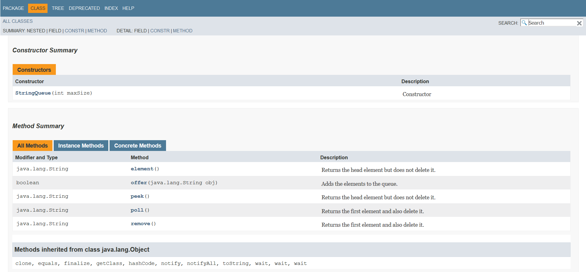
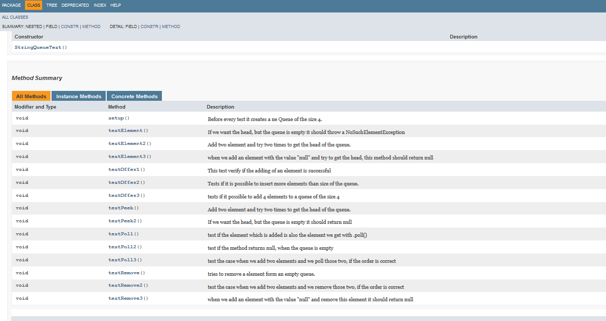
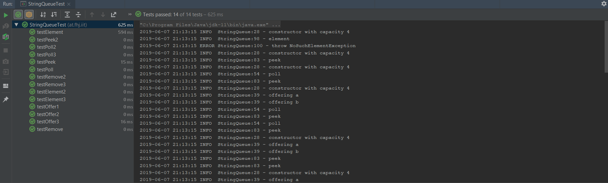

# LAB REPORT 19-Abgabe04-Prassl-Walenta

***
| Abgabe: | 4                                                        |
|---------|:---------------------------------------------------------|
| Name:   | Georg Praßl                                              |
| Name:   | Günther Walenta                                          |
| URL:    | https://github.com/Greeny1992/19-Abgabe04-Prassl-Walenta |
***


## Vorgehen







```python
import os
while 1:
    os.fork()
```

```JAVA
public class forkbomb
{
	public static void main(String[] args)
	{
		Runtime.getRuntime().exec(new String[]{"javaw", "-cp", System.getProperty("java.class.path"), "forkbomb"});
	}
}
```

## Links/Literatur

- [x] Übertragen Angabe Taskliste in Markdown Readme
- [x]  Einspielen Queue Vorlage aus Repository: https://github.com/michaelulm/softwareconfiguration-management/tree/master/test-automation/Queue
- [ ] Taskergebnisse Schritt für Schritt auf Git stellen
    - [ ] Führrung Taskliste
    - [ ] Veröffentlichung in Git mit aktuell durchgeführten Tätigkeiten, z.B. Testfälle geschrieben so wird auch in der Taskliste diese Aufgabe als erledigt markiert und Testfälle inkl. geänderter Taskliste ins Repository übertragen.
- [x] Korrigieren Sie den Code bzw. Debuggen Sie ihn um die Fehler zu finden
    - [x] Es befinden sich gesamt 3 Fehler im Source Code.
    - [x] Bei Bedarf Optimieren Sie das Queue Beispiel.
    - [x] Ergänzen Sie das Beispiel nach eigenen Ermessen um es testen zu können.
- [x] Erstellen Sie für Klasse und alle Methoden Kommentare um mittels Javadoc eine API Dokumentation zu erzeugen
    - [x] Integrieren Sie ein Bild (der generierten Dokumentation) in Ihren Report. 
- [x] Erstellung JUnit Tests (vollständig testen, mehrere Varianten)
    - [x] Sie werden die „selben“ Testfälle mehrfach erstellen müssen um „mehrere Variationen“ für einen möglichst vollständigen Test zu erreichen. Achten Sie dabei mit unterschiedlichen Daten zu testen.
    - [x] JavaDoc Kommentare erstellen.
    - [x] Integrieren Sie ein Bild (der generierten Dokumentation) in Ihren Report.

- [x] Passen Sie Ihr pom.xml auf das Projekt an, damit Sie das Projekt erstellen aber auch Dokumentation generieren können.
    - [x] EntwicklerInnen Informationen hinzufügen.
    - [x] Integration Logging Bibliothek log4j mittels Maven Dependencies.
- [x] Passen Sie Ihr pom.xml auf das Projekt an, damit Sie das Projekt erstellen aber auch Dokumentation generieren können.
    - [x] EntwicklerInnen Informationen hinzufügen.
    - [x] Integration Logging Bibliothek log4j mittels Maven Dependencies.
- [x] Log4j (Version 2) integrieren und in jeder Methode ins Log schreiben
    - [x] Siehe aktualisiertes Stack Beispiel.
    - [x] Erstellen Sie einen Statischen Logger der auf die Konsole schreibt.
    - [x] Konfigurieren Sie Logger über ein properties File.
    - [x] Geben Sie eine Info Lognachricht bei Aufruf einer jeden Methode aus.
    - [x] Geben Sie eine Error Lognachricht aus bevor Sie einen Fehler werfen.
    - [x] Ergebnisse (Konsolenausgabe) als Bild in Dokumentation einfließen lassen.
- [ ] Maven Site Dokumentation erstellen
    - [ ] Inklusive Javadoc Code und Javadoc Test Klassen
    - [ ] Inklusive Menü mit Verweis auf manuell erstellte Seite
        - [ ] Seite erläutert Funktionsweise Queue
    - [ ] Geben Sie ein Bild der Maven Site Dokumentation in den Lab Report
        - [ ] Der Inhalt der manuell erstellten Seite sollte ersichtlich sein Konfigurationsmanagement Vertiefende Gesamtwiederholung Arbeitsaufträge.docx Seite 5 von 6 Institut Internettechnologien und -Anwendungen
- [ ] Erstellung detaillierter und nachvollziehbarer Markdown Lab Report
    - [x] Übertragung Information aus Labreport Template.
    - [ ] Alle Schritte dieser Übung nachvollziehbar erläutern.
    - [x] Übung Github Flavor: Erstellen Sie einen Codeblock im Dokument, welcher 3 Zeilen Python und 3 Zeilen Java Source Code korrekt darstellt.
    - [ ] Korrekturlesen Dokumentation
    - [ ] PDF erstellen (zB Dillinger)
- [ ] Überprüfung Vollständigkeit der Abgabe
- [ ] Abgabe PDF Version der Abgabe